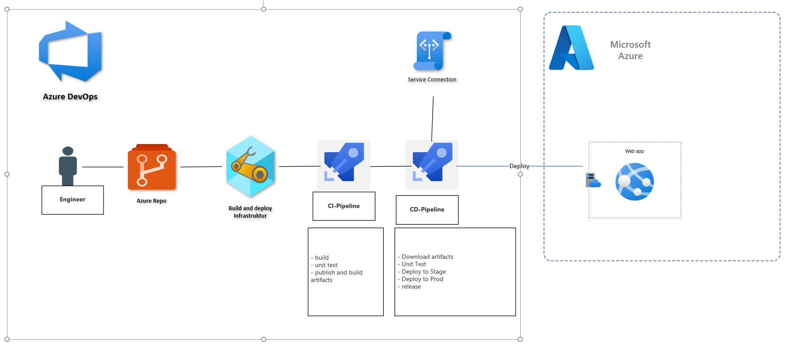
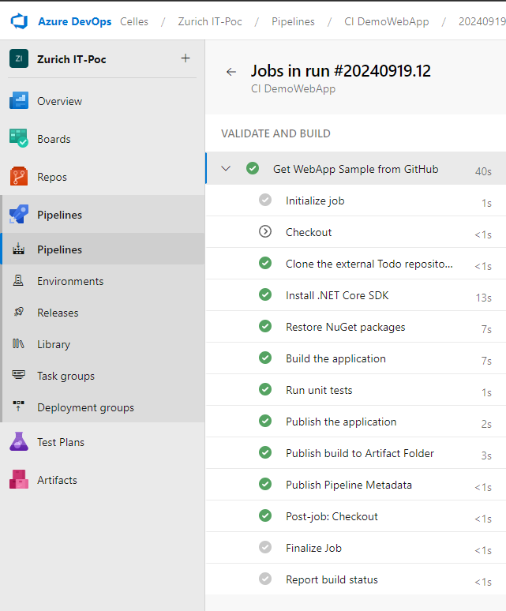

# 2. Azure DevOps Pipelines (ADO) Aufgabe: CI/CD Pipeline für Azure Web App
Aufgabe: Implementieren Sie eine vollständige CI/CD-Pipeline in Azure DevOps für eine Web-App.


Anforderungen:
1. Erstellen Sie eine YAML-basierte Pipeline, die den Code einer Beispiel-Web-App aus einem Git-Repository abruft.
2. Stellen Sie sicher, dass die Pipeline einen Build-Prozess durchführt und anschließend die Anwendung in einer Azure Web App bereitstellt.
3. Fügen Sie Schritte zur Durchführung von Unit-Tests und zur Bereitstellung der App im Staging und dann in der Produktionsumgebung hinzu.


## Lösung



Um diese Aufgabe zu erfüllen, wird der CI/CD-Prozess in zwei Teile unterteilt: Build-Pipeline und Release-Pipeline.

### 1. Build-Pipeline (YAML)

```yaml
trigger: 
  branches:
    include:
      - main
pool:
  vmImage: 'ubuntu-latest'

variables:
  location: 'westeurope'  
  buildConfiguration: 'Release' 
  webapprepo: 'https://github.com/nkathawa/Todo.git'  # GitHub-Repository-URL für die Demo-Web-App

stages:
- stage: VALIDATE_BUILD
  displayName: 'VALIDATE AND BUILD'
  jobs:
    - job: GetWebAppSample
      displayName: 'Get WebApp Sample from GitHub'

      steps:
        # Schritt 1: Deaktivieren Sie das automatische Checkout des aktuellen Azure DevOps-Repositorys
        - checkout: none

        # Schritt 2: Klonen Sie das externe GitHub-Repository
        - script: |
            git clone $(webapprepo)
          displayName: 'Clone the external Todo repository'

        # Schritt 3: Installieren Sie die .NET Core SDK-Version 7.x
        - task: UseDotNet@2
          inputs:
            packageType: 'sdk'
            version: '7.x'
          displayName: 'Install .NET Core SDK'

        # Schritt 4: Wiederherstellen von NuGet-Paketen für das Projekt
        - script: |
            cd Todo
            dotnet restore
          displayName: 'Restore NuGet packages'

        # Schritt 5: Bauen Sie die Anwendung mit der angegebenen Konfiguration
        - script: |
            cd Todo
            dotnet build --configuration $(buildConfiguration)
          displayName: 'Build the application'
          continueOnError: false  # Pipeline stoppen, wenn der Build fehlschlägt

        # Schritt 6: Führen Sie Unit-Tests durch, um den Build zu validieren
        - script: |
            cd Todo
            dotnet test --configuration $(buildConfiguration)
          displayName: 'Run unit tests'
          continueOnError: false  # Pipeline stoppen, wenn Tests fehlschlagen

        # Schritt 7: Veröffentlichen Sie die Build-Artefakte (nur wenn Tests und Build erfolgreich sind)
        - script: |
            cd Todo
            dotnet publish --configuration $(buildConfiguration) --output $(Build.ArtifactStagingDirectory)
          displayName: 'Publish the application'
          condition: succeeded()  # Nur ausführen, wenn alle vorherigen Schritte erfolgreich sind

        # Schritt 8: Hochladen des veröffentlichten Builds in den Artefakt-Ordner
        - task: PublishBuildArtifacts@1
          displayName: 'Publish build to Artifact Folder'
          inputs:
            PathtoPublish: '$(Build.ArtifactStagingDirectory)'  
            ArtifactName: 'drop'  
            publishLocation: 'Container'
          condition: succeeded()  # Nur ausführen, wenn alle vorherigen Schritte erfolgreich sind
```



### 2. Release-Pipeline

Die Release-Pipeline umfasst die folgenden Schritte:

1. **Abrufen der Artefakte**: Holen Sie sich die Build-Artefakte aus der Build-Pipeline.
2. **Bereitstellung in der Testumgebung**: Veröffentlichen Sie den Build in der Testumgebung.
3. **Unit-Tests ausführen**: Führen Sie Unit-Tests in der Testumgebung durch.
4. **Bereitstellung in der Produktionsumgebung**: Nach bestandenen Unit-Tests und Genehmigung durch den Geschäftsinhaber wird der Build in der Produktionsumgebung bereitgestellt.

Der Genehmigungsprozess stellt sicher, dass der Geschäftsinhaber die Bereitstellung in der Produktion manuell genehmigen muss.


---

## Zusammenfassung

- Die Build-Pipeline ruft den Code aus einem GitHub-Repository ab, erstellt die App mit dem .NET Core SDK, führt Unit-Tests durch und veröffentlicht die Build-Artefakte.
- Die Release-Pipeline übernimmt die Bereitstellung in der Staging- (Test-) und Produktionsumgebung. Dabei werden Unit-Tests vor der Produktionsbereitstellung ausgeführt und eine Genehmigung des Geschäftsinhabers vor dem endgültigen Release eingeholt.