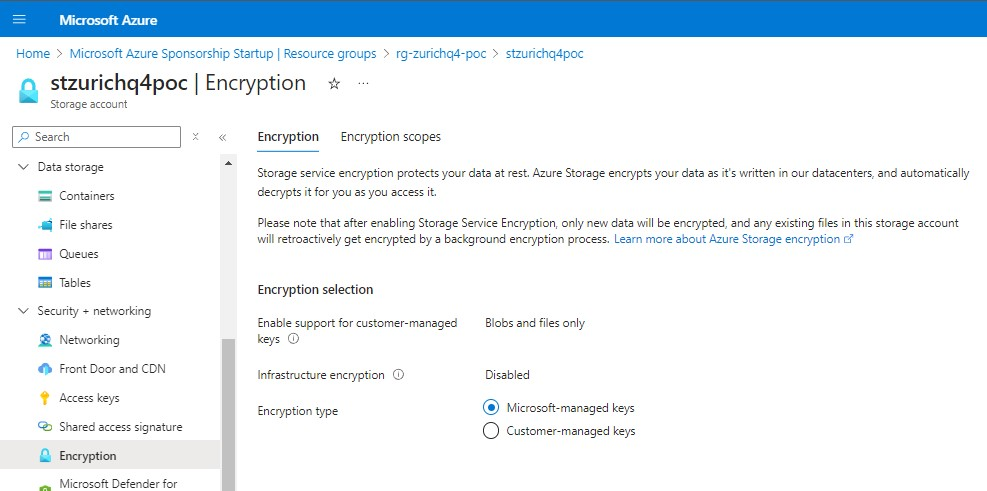
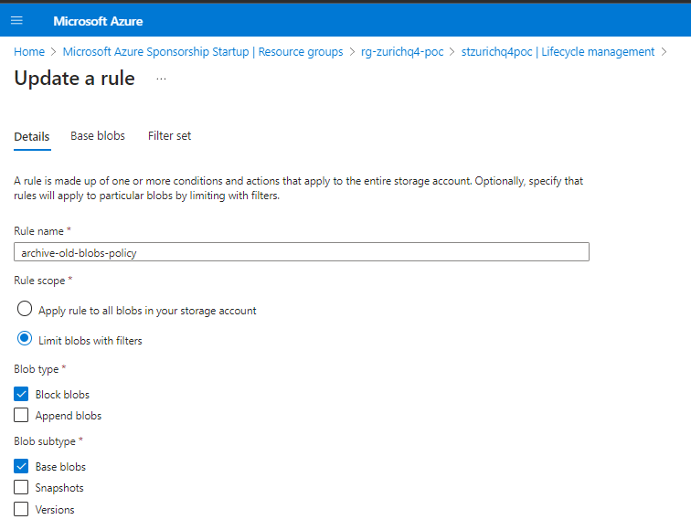

# 4. Speicheraufgabe: Erstellung eines Storage-Accounts mit Verschlüsselung und Zugriffsrichtlinien

Aufgabe: Konfigurieren Sie einen Azure Storage Account für ein Projekt mit spezifischen Sicherheitsanforderungen.

## Anforderungen:
1. Erstellen Sie einen Storage Account mit blob encryption aktiviert.
2. Richten Sie eine Shared Access Signature (SAS) ein, die nur für 1 Stunde gültig ist und nur Lesezugriff auf eine bestimmte Blob-Datei ermöglicht.
3. Erstellen Sie eine Lifecycle-Policy, die ältere Blobs automatisch archiviert.

# Antwort:
Ich habe die Aufgabe mit Terraform implementiert, um das Konzept der Infrastructure as Code (IaC) zu verdeutlichen, auch wenn dies nicht explizit gefordert war:

## Storage Account
```yaml
resource "azurerm_storage_account" "storage_account" {
  name                     = "st${var.project}${var.environment}"
  resource_group_name      = azurerm_resource_group.rg_storage.name
  location                 = azurerm_resource_group.rg_storage.location
  account_tier             = "Standard"
  account_replication_type = "LRS"

  blob_properties {
    versioning_enabled = true

    
  }

  https_traffic_only_enabled = true
  min_tls_version = "TLS1_2"

  tags = {
    owner       = "Wael Amer"
    environment = var.environment
    project     = var.project
  }
}

resource "azurerm_storage_container" "storage_container" {
  name                  = var.container_name
  storage_account_name  = azurerm_storage_account.storage_account.name
  container_access_type = "private"
}

resource "azurerm_storage_blob" "storage_blob" {
  name                   = var.blob_name
  storage_account_name   = azurerm_storage_account.storage_account.name
  storage_container_name = azurerm_storage_container.storage_container.name
  type                   = "Block"
}


```

## Lifecycle Policy

```yaml
resource "azurerm_storage_management_policy" "lifecycle_policy" {
  storage_account_id = azurerm_storage_account.storage_account.id

  rule {
    name    = var.policy_name
    enabled = true

    filters {
      prefix_match = [var.container_name]
      blob_types   = ["blockBlob", "appendBlob"]
    }

    actions {
      version {
        delete_after_days_since_creation = 60
      }
    }
  }
}

```

## SAS Token


```yaml

data "azurerm_storage_account_sas" "sas_token" {
  connection_string = azurerm_storage_account.storage_account.primary_connection_string

  permissions {
    read    = true
    write   = false
    delete  = false
    list    = true
    add     = false
    create  = false
    update  = false
    process = false
    filter  = false
    tag     = false
  }

  resource_types {
    service   = true
    container = true
    object    = true
  }

  services {
    blob  = true
    queue = false
    file  = false
    table = false
  }

  start  = timestamp()
  expiry = timeadd(timestamp(), "1h")
}

output "sas_url" {
  description = "SAS URL for the blob with read-only access"
  value       = replace("${azurerm_storage_account.storage_account.primary_blob_endpoint}${azurerm_storage_container.storage_container.name}/${azurerm_storage_blob.storage_blob.name}${data.azurerm_storage_account_sas.sas_token.sas}", "\u0026", "&") 
  sensitive   = true
}

```

Dies wird ein Azure Storage-Konto mit Blob-Verschlüsselung, ein SAS-Token, das für 1 Stunde gültig ist, und eine Lebenszyklusrichtlinie erstellen, um ältere Blobs nach 60 Tagen zu löschen.



